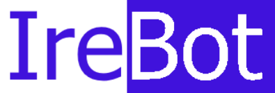
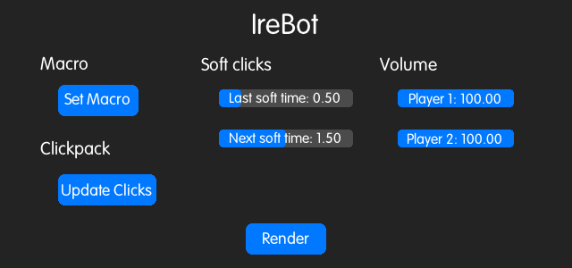

<a href="https://discord.gg/RQttgV6Mmg"></a>


## Building

  ### Prerequisites
   - MINGW
   - GCC
   - make


  ```
  git clone https://github.com/equitatyo/irebot.git
  cd irebot
  make
  ```
  
  You will need to move glfw3.dll into the build folder and arial_rounded.tff to build/assets/
  
## Usage
  Player 1 and player 2 clicks should be placed in /build/player1 and /build/player2 respectively
  
  Click structure should look like the following
  
  ```
  player1
  │
  └───clicks
  │   │   1.wav
  │   │   2.wav
  │   │   ...
  │   
  └───clicks
  │   │   1.wav
  │   │   2.wav
  │   │   ...
  │   
  └───releases
  │   │   1.wav
  │   │   2.wav
  │   │   ...
  │   
  └───softClicks
  │   │   1.wav
  │   │   2.wav
  │   │   ...
  │   
  └───softReleases
      │   1.wav
      │   2.wav
      │   ...
  ```
  
## Screenshots


  
## Contributors
  - equitatyo
